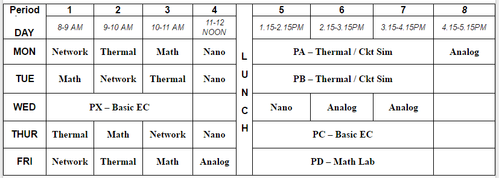

3rd Semester, Electronics and Communication Engineering (ECE), NIT Rourkela
(Monsoon 2011).
 
 

Courses:
- [mathematics-3](https://github.com/nitrece/mathematics-3)
- [networks](https://github.com/nitrece/networks)
- [algorithm-design](https://github.com/nitrece/algorithm-design)
- [numerical-methods-laboratory](https://github.com/nitrece/numerical-methods-laboratory)
- [basic-electronics-laboratory](https://github.com/nitrece/basic-electronics-laboratory)

 

 
